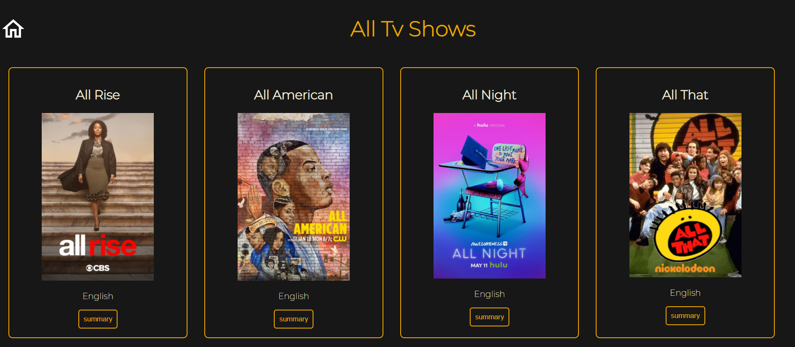
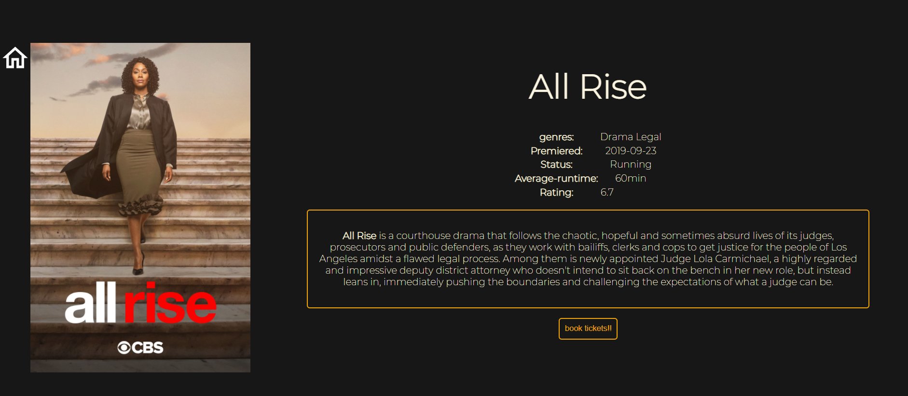
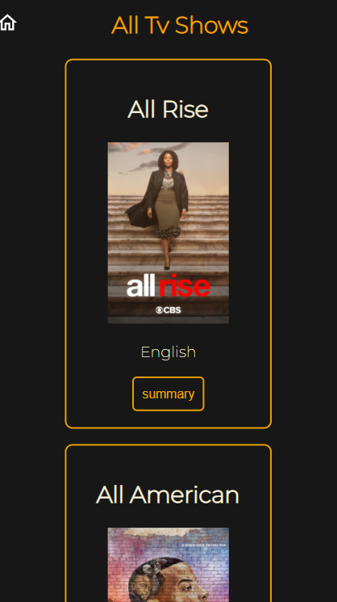
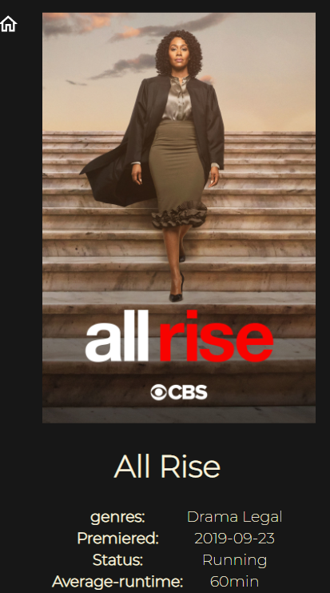

# All-Tv-Show  
This website features ten tv-shows and their summary. All the data is fetched from the [TVmaze API](https://api.tvmaze.com/search/shows?q=all).     

# How to use     
1. Every tv show has a summary button below its name and you can check various information related to the show inside the summary section.  
2. Inside the summary section you can find the book tickets button which opens a form for collecting the information and information is stored in local storage.  
3. After filling in the details you can see the confirmation message.     

# Tech-stack   
1.HTML   
2.CSS   
3.React Js   
[Checkout Live Project](https://all-tv-shows.netlify.app/)   

# Preview  
## Web-preview  
  
    

## Small-screen    
    
   

